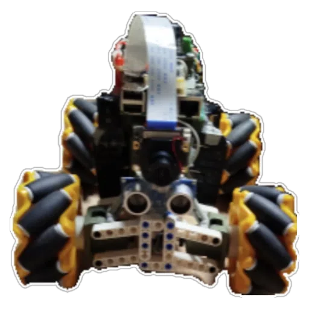

# ============================

# 🤖 Robot Omni — Architecture complète (Arduino + Raspberry Pi)



# ============================

Ce document regroupe l’ensemble du système robotique :

- Arduino : contrôle bas niveau, PID, moteurs  
- Raspberry Pi : cockpit web, IA, WebRTC, radar, WebSockets  

---

# 🧱 Architecture générale

```cpp
Cockpit Web <---- WebRTC ----> Raspberry Pi (server.py)
|                               |
| WebSocket CTRL                | UART
| WebSocket ENC / RADAR         |
v                               v
Encodeurs / Radar -------------> Arduino Mega
```

---

## 🧠 Rôles des composants

### Raspberry Pi
- Serveur WebRTC  
- Serveur WebSocket  
- IA TD3/DQN  
- Radar ultrason  
- Communication UART vers Arduino  

### Arduino Mega
- Lecture encodeurs  
- PID vitesse  
- PWM moteurs  
- Watchdog sécurité  
- Protocole série  

---

## 🔁 Boucle complète du robot

1. Cockpit envoie commandes (MANUAL ou AI)  
2. Raspberry Pi transmet `VEL vx vy w` à l’Arduino  
3. Arduino convertit en vitesses roues  
4. PID → PWM moteurs  
5. Encodeurs → Raspberry Pi  
6. IA apprend en continu (MODE AI)  
7. WebRTC transmet la vidéo au cockpit  

---

### 🛠️ Communication

### UART (Pi → Arduino)

```cpp
VEL vx vy w
MODE AI
PING
```

### UART (Arduino → Pi)

```cpp
ENC ticks speeds
PONG
```


### WebSockets (Pi ↔ Cockpit)
- /ws-ctrl  
- /ws-enc  
- /ws-radar  
- /ws-rtc  
- /ws-ai  
- /ws-ai-config  

---

## 🎛️ PID & Cinématique (Arduino)

- PID 50 Hz  
- PWM_MAX = 200  
- MAX_WHEEL_SPEED = 500 ticks/s  
- Watchdog 500 ms  

---

## 🎥 WebRTC (Raspberry Pi)

```cpp
libcamerasrc → videoconvert → appsink → aiortc → WebRTC → navigateur
```


---

## 🧠 IA (Raspberry Pi)

- TD3 ou DQN  
- Apprentissage en temps réel  
- Reward basée sur vitesse, obstacles, collisions  
- Diffusion cockpit : reward, critic_loss, actor_loss, actions, épisode  

---

## 🧪 Tests finaux

- Radar OK  
- UART OK  
- WebRTC OK  
- IA OK  

---

## 🚀 Production

Service systemd pour démarrage automatique.

 
 
